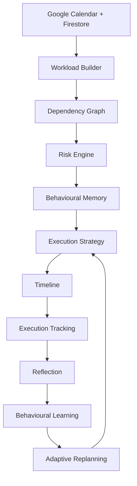

# Momentum

> **An AI Executive Assistant that helps you finish your work before deadlines, not just remind you about them.**

Momentum was built to solve a simple problem:

Traditional productivity apps tell you **what** you need to do.

Momentum figures out **how you'll actually get it done.**

Instead of acting like a calendar or task manager, Momentum continuously observes your workload, predicts risk, builds a dependency-aware execution strategy around your real commitments, learns from your behaviour over time, and replans automatically as your day changes.

Its planning loop is:

**Observe → Predict → Plan → Execute → Reflect → Learn → Adapt**

---

# Try Momentum in under a minute

### Live Demo

**https://momentum-5f290.web.app**

Click **"Try Interactive Demo Workspace"** on the landing page.

The Demo Workspace contains:

* realistic Google Calendar events
* several weeks of execution history
* behavioural memory already learned from past work
* previous reflections
* automatic replanning
* recovery planning
* execution tracking

No Google sign-in is required.

Every AI feature runs through the exact same planning pipeline as the production version, the only difference is the data source.

To use your own calendar instead, choose **"Connect Google Calendar."**


---

# Key Features

* AI Executive Assistant (not a reminder app)
* Google Calendar understanding
* Dependency-aware task graph generation
* Intelligent execution scheduling
* Continuous replanning
* Behavioural learning engine
* Execution tracking
* Guided reflections
* Recovery planning
* Explainable AI decisions ("Why this?", "Why now?")
* Gemini-powered reasoning with deterministic local fallback
* Interactive Demo Workspace for instant evaluation

---

# How Momentum Works



---

# Tech Stack

### Frontend

* React 18
* TypeScript
* Vite
* Tailwind CSS
* Framer Motion

### Backend & Infrastructure

* Firebase Authentication
* Cloud Firestore
* Google Calendar API
* Gemini API
* Docker
* Nginx
* Google Cloud Run
* Firebase Hosting

---

# Architecture

Momentum has **one planning pipeline**.

Every page in the application (Dashboard, Day, Calendar, Recovery, Why, Reflection) renders the exact same planner output.

No page computes its own schedule independently.

Demo Workspace and Google Calendar are simply two interchangeable data providers feeding the same orchestration engine.

See **ARCHITECTURE.md** for the full system design.

---

# Running Locally

```bash
npm install

cp .env.example .env.local

# Add Firebase and Gemini credentials

npm run dev
```

---

# Production Build

```bash
npm run build
```

---

# Deployment

See **DEPLOY.md** for the complete deployment guide.

The live demo above is deployed on **Firebase Hosting** (no billing account required). The project is also containerised with Docker for deployment to **Google Cloud Run**  both paths are documented in DEPLOY.md.

---

# Project Documentation

See **PROJECT_DESCRIPTION.md** for:

* Problem Statement
* Solution Overview
* Architecture
* Key Features
* Google Technologies Used
* Technical Design

---

Built for the **Vibe2Ship**.

**Problem statement: The Last-Minute Life Saver** an AI Executive Assistant that helps people complete work before deadlines, instead of simply reminding them.
