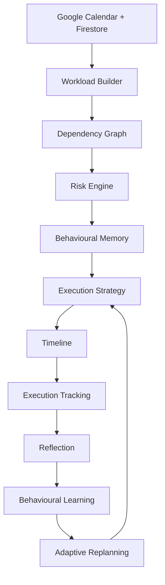

# Momentum

Momentum is an **AI Executive Assistant** built for the Google AI Hackathon
that proactively helps users finish work before deadlines by continuously
observing, planning, learning, and adapting — not a calendar, not a task
manager, not a reminder app.

**Live demo:** https://momentum-5f290.web.app

<!-- Add a hero screenshot or short GIF of the Dashboard here before submitting. -->

Momentum observes your calendar and workload, predicts risk, builds a
dependency-aware execution strategy around your real commitments, learns
from how you actually work, and adapts the plan as the day unfolds. The
loop: **Observe → Predict → Plan → Execute → Reflect → Learn → Adapt.**

## Evaluate it in under a minute

Open the [live demo](https://momentum-5f290.web.app) and click **Try
Interactive Demo Workspace** on the landing page — a realistic,
already-learned-from workspace (several weeks of execution history,
behavioural memory, and reflections) with **no Google sign-in required**.
Every feature works identically to the production path; only the data
source differs. **Connect Google Calendar** is the production path for a
user's own real schedule.

<!-- Add screenshots of Dashboard / Day / Recovery / Reflection here. -->

## Run locally

```bash
npm install
cp .env.example .env.local   # fill in real Firebase + Gemini values
npm run dev
```

## Build

```bash
npm run build
```

## Deploy

See [DEPLOY.md](./DEPLOY.md) — covers both the Firebase Hosting path used
for the live demo above and the Cloud Run path (Dockerfile + Cloud Build).

## Stack

- React 18 + TypeScript + Vite, Tailwind CSS, Framer Motion
- Firebase Auth (Google OAuth) + Cloud Firestore
- Google Calendar API
- Gemini API, with a fully deterministic local fallback for every AI agent
  (the product never goes blank if Gemini is unavailable)
- Deployed on Firebase Hosting / Google Cloud Run

## Architecture

Behavioural memory, risk assessment, the dependency-aware task graph,
execution tracking, reflection, and recovery all run through **one
orchestrator pipeline** — every page (Dashboard, Day, Calendar, Recovery,
Why, Reflection) renders the same planner output rather than deriving its
own logic. Demo Workspace and Google Calendar are two interchangeable data
providers feeding that same pipeline — full detail in [ARCHITECTURE.md](./ARCHITECTURE.md).



## Project description

See [PROJECT_DESCRIPTION.md](./PROJECT_DESCRIPTION.md) for the problem
statement, solution overview, key features, and technologies used (same
content submitted as the Google Doc).

---

### Built for the Google AI Hackathon

**Problem statement: The Last-Minute Life Saver**

An AI Executive Assistant that helps people complete work before deadlines,
instead of simply reminding them.
